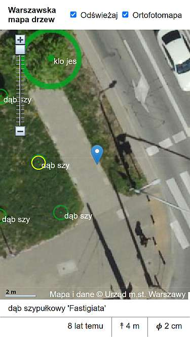

# Warszawska mapa drzew

## Dodatkowe informacje

Inna mapa: https://mapa.um.warszawa.pl/mapaApp1/mapa?service=zielen

Biblioteka [proj4](https://github.com/proj4js/proj4js) - przekształca współrzędne między różnymi układami.
